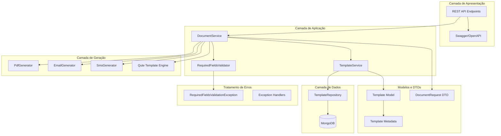
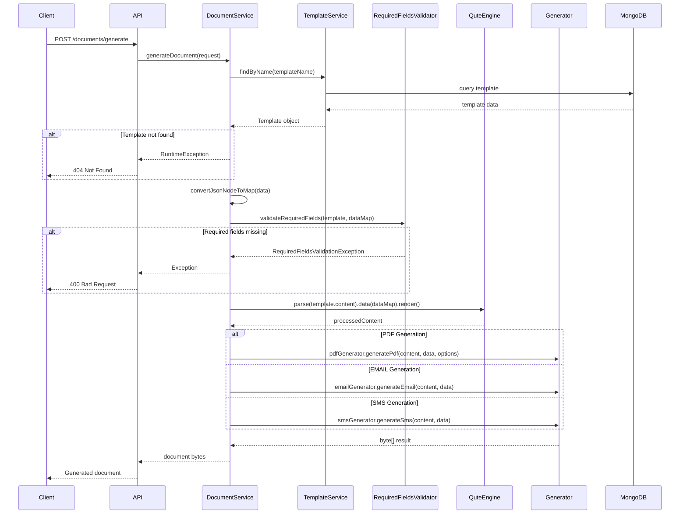
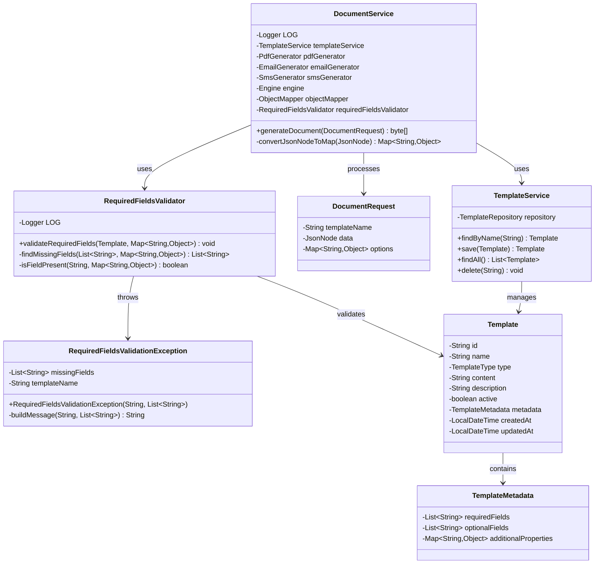
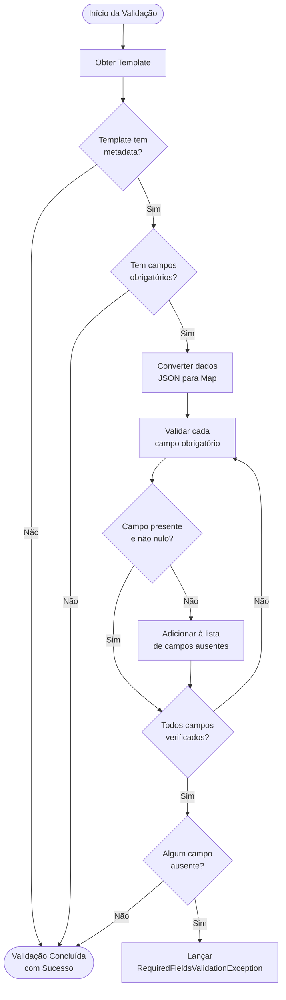
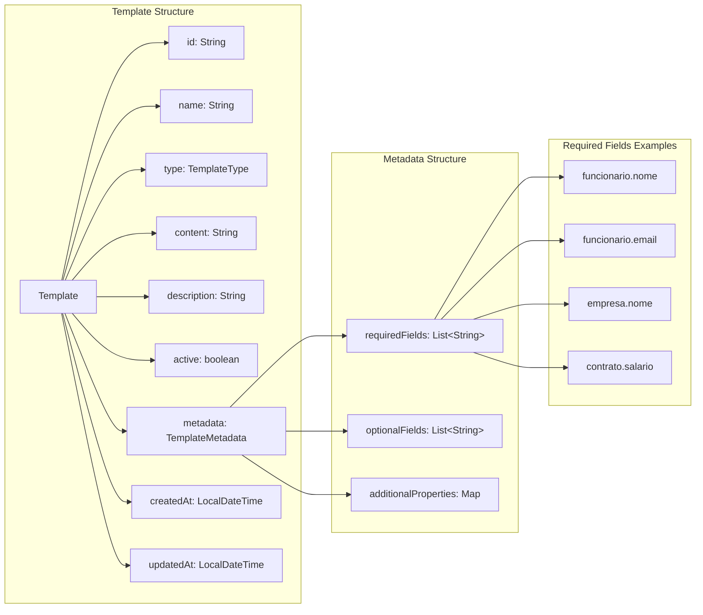
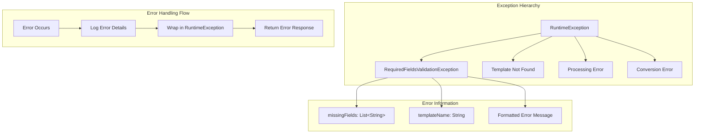
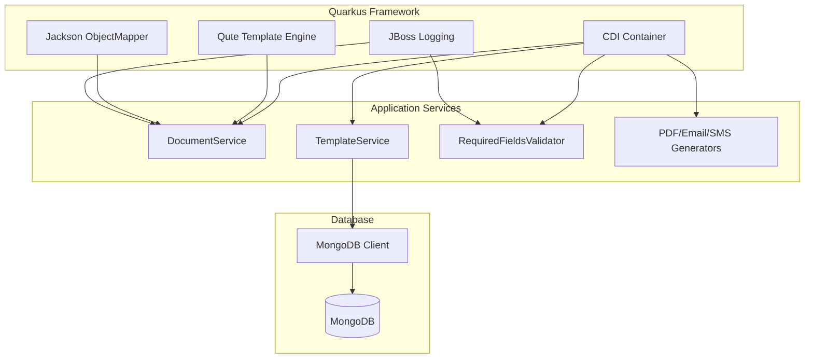
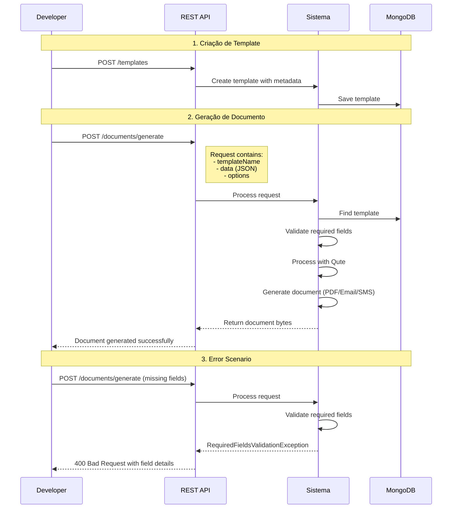

# Diagrama de Arquitetura - Sistema de Templates (sistemplate)

Este documento apresenta diagramas detalhados da arquitetura do Sistema de Templates para facilitar o entendimento do projeto por LLMs e desenvolvedores.

## 1. Visão Geral da Arquitetura



## 2. Fluxo de Geração de Documentos



## 3. Estrutura de Classes e Relacionamentos



## 4. Fluxo de Validação de Campos Obrigatórios



## 5. Estrutura de Dados do Template



## 6. Tipos de Documentos Suportados

```mermaid
graph TD
    subgraph "Document Types"
        DT[TemplateType]
        DT --> PDF[PDF Documents]
        DT --> EMAIL[Email Messages]
        DT --> SMS[SMS Messages]
    end
    
    subgraph "PDF Generation"
        PDF --> PDFG[PdfGenerator]
        PDFG --> PDFOPTS[Options: filename, orientation, pageSize]
        PDFG --> PDFOUT[Output: byte[] PDF]
    end
    
    subgraph "Email Generation"
        EMAIL --> EMAILG[EmailGenerator]
        EMAILG --> EMAILOUT[Output: byte[] Email]
    end
    
    subgraph "SMS Generation"
        SMS --> SMSG[SmsGenerator]
        SMSG --> SMSOUT[Output: byte[] SMS]
    end
```

## 7. Tratamento de Erros e Exceções



## 8. Configuração e Dependências



## 9. Exemplo de Uso Completo



## Resumo dos Componentes Principais

### Serviços Core
- **DocumentService**: Orquestra todo o processo de geração de documentos
- **TemplateService**: Gerencia templates no banco de dados
- **RequiredFieldsValidator**: Valida campos obrigatórios antes da geração

### Geradores
- **PdfGenerator**: Gera documentos PDF
- **EmailGenerator**: Gera mensagens de email
- **SmsGenerator**: Gera mensagens SMS

### Modelos de Dados
- **Template**: Representa um template com metadata
- **TemplateMetadata**: Contém configurações como campos obrigatórios
- **DocumentRequest**: DTO para requisições de geração

### Tratamento de Erros
- **RequiredFieldsValidationException**: Exceção específica para campos ausentes
- Sistema de logging detalhado para debugging

### Tecnologias
- **Quarkus**: Framework principal
- **Qute**: Engine de templates
- **MongoDB**: Banco de dados
- **Jackson**: Processamento JSON
- **CDI**: Injeção de dependências

Este diagrama fornece uma visão completa da arquitetura e pode ser usado como referência para entender o funcionamento do sistema, implementar novas funcionalidades ou realizar manutenções.